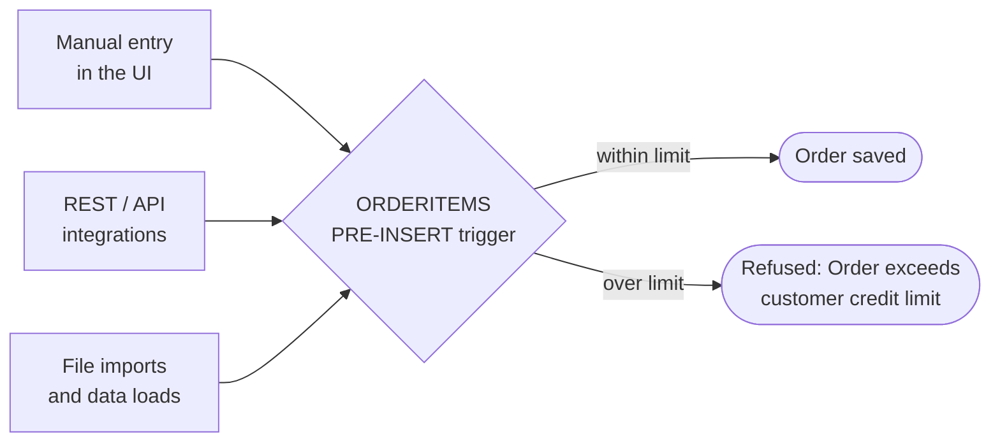

# Priority — Credit Control

  [](LICENSE)



Every entry path goes through the same check, because it lives in a form trigger rather than in a screen.

Two pieces of a single sales-order control in Priority ERP: a hard credit-limit block on order
lines, and the report that shows the exposure behind it.

| File | What it is |
|---|---|
| [`sqli/01-open-orders-report.sql`](sqli/01-open-orders-report.sql) | Procedure `AIDV_OPENORD`: input screen → SQLI fills a linked report table → report |
| [`sqli/02-credit-limit-trigger.sql`](sqli/02-credit-limit-trigger.sql) | `ORDERITEMS` PRE-INSERT (+ PRE-UPDATE via `#INCLUDE`): blocks lines over the credit limit |

## The rule

> A/R balance + the customer's other open orders + the other lines of this order + the line being
> saved > credit limit → refuse, with the message *"Order exceeds customer credit limit"*.

A limit of `0` means no limit. Priority's built-in credit check only warns; this one refuses.

Because it sits on the form trigger rather than in a screen, it applies to **every** entry path —
the UI, the REST/OData API, and file interfaces. Orders arriving from the web shop through the
[`shopify-erp-order-sync`](https://github.com/Milo-ai-HQ/shopify-erp-order-sync) service hit the
same trigger.

## The report

Procedure `AIDV_OPENORD` — open orders by customer, with an optional customer and date range:

```
10  INPUT   CST (link to CUSTOMERS, optional), FDT / TDT (dates, optional)
20  SQLI    01-open-orders-report.sql
30  REPORT  AIDV_OPENORDRPT   (Report Generator, based on table AIDV_OPENORD)
```

Custom table `AIDV_OPENORD`: `CUST` (joins `CUSTOMERS.CUST`), `ORDCNT`, `OPENAMT`.

## Conventions

Every custom object and trigger variable carries the `AIDV_` prefix. The credit limit is the custom
column `CUSTOMERS.AIDV_CREDITLIM` — to use the customer's standard Obligo instead, replace the first
`SELECT` in the trigger; nothing else changes. Messages 500/501 are form messages on `ORDERITEMS`.


---

## The same scenario, other platforms

Open orders by customer, a hard credit-limit block, and a Shopify order feed — built natively on each ERP:

- [Priority — Order Load Interface](https://github.com/Milo-ai-HQ/priority-order-load-interface)
- [NetSuite — Sales Controls](https://github.com/Milo-ai-HQ/netsuite-sales-controls)
- [Business Central — Sales Controls](https://github.com/Milo-ai-HQ/business-central-sales-controls)
- [Odoo — Sales Controls](https://github.com/Milo-ai-HQ/odoo-sales-controls)
- [Shopify → ERP Order Sync](https://github.com/Milo-ai-HQ/shopify-erp-order-sync)
